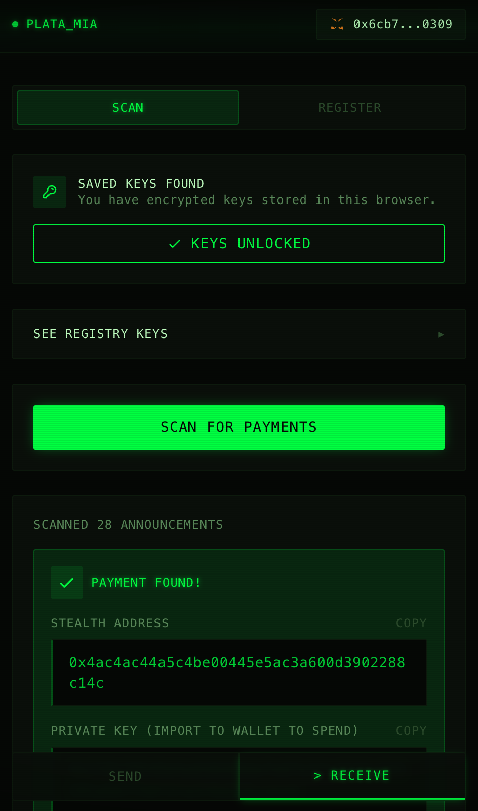
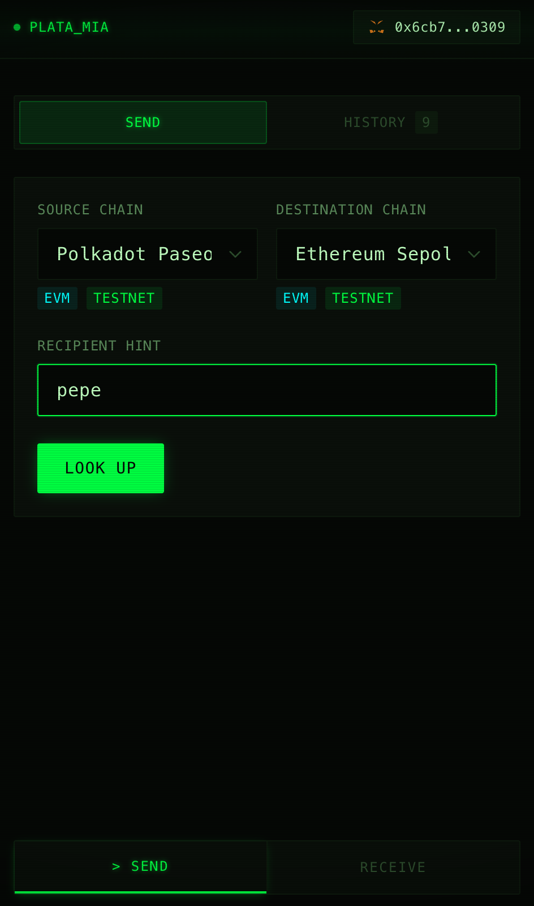
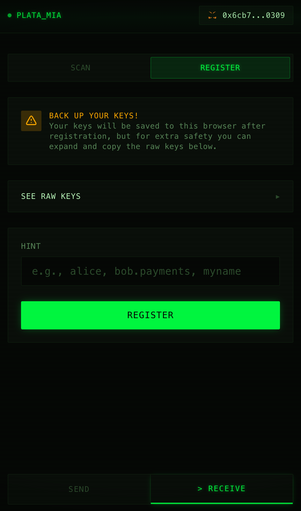
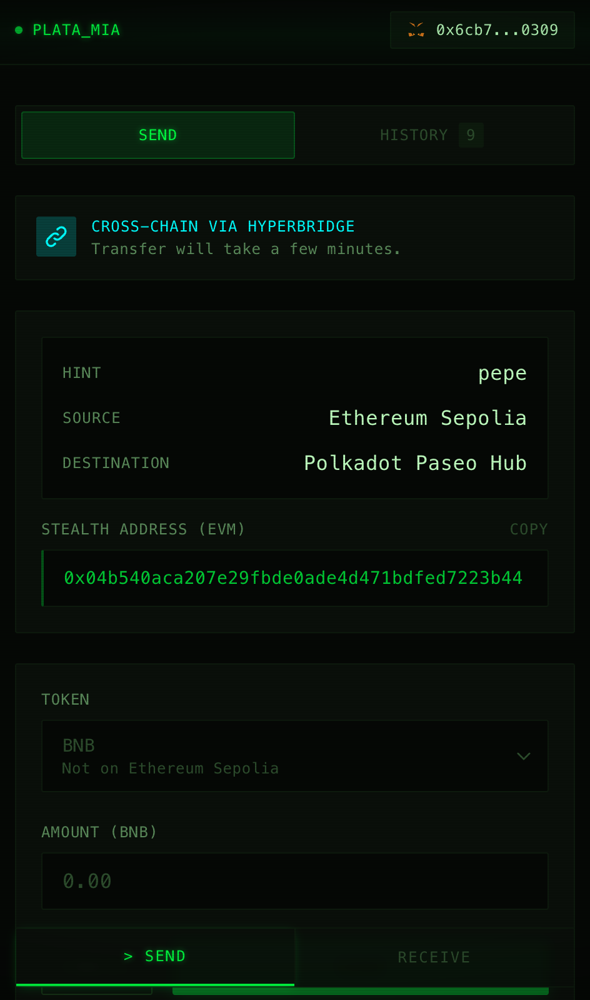

# PLATA_MIA

Privacy-preserving stealth payments across EVM chains. Recipients register secp256k1 keys on-chain, senders derive one-time stealth addresses locally and transfer tokens single or cross-chain via Hyperbridge. Payment announcements propagate through xx-network's cMix mixnet so only the recipient can detect incoming funds.

<p>
  
  
  
  
</p>

[Live app](TODO) | [Docs](TODO)

---

## How It Works

1. **Register** — the recipient generates a stealth meta-address (spending + viewing keys) and publishes it to the on-chain registry so anyone can look them up
2. **Send** — the sender looks up the recipient, derives a one-time stealth address locally, and transfers tokens on the same chain or cross-chain via Hyperbridge
3. **Announce** — a payment announcement is routed through xx-network's cMix mixnet so the recipient can detect incoming funds without revealing any link between sender and receiver
4. **Receive** — the recipient scans announcements with their viewing key, finds matching payments, and redeems them to their wallet

## Packages


| Package                                         | Description                                                                                                                |
| ----------------------------------------------- | -------------------------------------------------------------------------------------------------------------------------- |
| [web-app](packages/web-app)                     | Next.js frontend — register keys, look up recipients, send and receive stealth payments, track cross-chain transfer status |
| [stealth-core](packages/stealth-core)           | secp256k1 stealth address cryptography                                                                                     |
| [registry-contract](packages/registry-contract) | On-chain stealth meta-address registry (Foundry)                                                                           |
| [xx-proxy](packages/xx-proxy)                   | Go proxy for xx-network private announcements                                                                              |


## Deployments

| Contract | Network | Address |
| --- | --- | --- |
| Registry | Polkadot Paseo Hub | [`0x47568470D89CD2Ea20553ffB08bD630BC95FE4bB`](https://blockscout-paseo.parity-chains.parity.io/address/0x47568470D89CD2Ea20553ffB08bD630BC95FE4bB) |

## Local Development

### 1. xx-proxy (announcement backend)

```bash
cd packages/xx-proxy
cp .env.example .env          # set XX_CERT_PATH and XX_PASSWORD
make build && make run         # starts on :8080
```

Requires a `mainnet.crt` file — see [xx-proxy README](packages/xx-proxy) for details.

### 2. web-app

```bash
cd packages/web-app
cp .env.example .env          # set NEXT_PUBLIC_NETWORK=testnet, proxy URL
pnpm install
pnpm dev                      # starts on :3000
```

Connect MetaMask to a testnet (Ethereum Sepolia, Arbitrum Sepolia, Paseo Hub, etc.), get test tokens from the [Polkadot faucet](https://faucet.polkadot.io/) for Paseo, and you're ready to register, send, and receive.

---

[Live app](TODO) | [Docs](TODO)